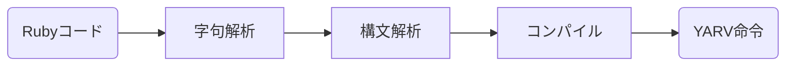

## はじめに

※ 執筆中なので引用と文体は雑。とりあえず書き切ることが目標。

本記事は友達のいない私が2023-2024の冬休みの自由研究の成果として書いていく記事です。
エンジニア歴も文系出身でコンピューターサイエンスやプログラミング言語に関する知識も浅いので、運悪く本記事を見てしまった方は温かい舌打ちをしながら見守ってください。

## 本記事の概要

本記事はタイトルの通り、『[Rubyのしくみ　Ruby Under a Microscope]()』と『[計算理論の基礎 1.オートマトンと言語]()』を読んで学んだことを融合して体系的に書いていきたいと思います。どっちかというと計算理論寄りの内容になります。

ただそのまま本の内容を書くのも面白くないので、「計算理論を学ぶ意義について」「具体的なプログラミング言語ではなく数学的な記号を使って言語を考えるモチベーションについて」「普段のプログラミング業務から直感的に計算理論へ辿りつく考え方」をベースに学んだ内容を再構築して行こうかなと思います。

そしてなにより業務にはそんな関係ないけど、rubyのしくみや計算理論は面白いなあと感じたことを出していきたいです。

## 目次

1. 言語とはなにか？ 〜テーマを決める〜
2. この記事のゴールと方針を設定する
3. Rubyのしくみの字句解析を部分を読む
4. 字句解析と正規表現について考える
5. 正規表現から有限オートマトンを導く
6. 有限オートマトンの非決定性と有用な性質について
7. まとめ/次回予告
8. 参考文献

## 1. 言語とはなにか？ 〜テーマを決める〜

### ⅰ. テーマを考える

本題に入る前に、考えておきたいことがあります。それは本記事を通して一貫するテーマです。
テーマの中心は【プログラミング言語】ということになりそうですが、せっかくなので脱線してもうちょっと深堀って考えてみましょう。

実はですが私が本記事のタイトルでもある、『Rubyのしくみ』や『計算理論』に興味を持ったのはプログラミングではないところから来ていて、言語哲学や言語学に関しての本を読んでいたのがきっかけです。【言語】そのものに関する疑問が【プログラミング言語】に対して考えられるのではないか、というふうに思ったのです（もちろん言語哲学も言語学もコンピューターサイエンスに多大な影響を与えてはいるのでプログラミングに関係ないとは言い切れませんが....）。なのでここで軽く言語哲学と言語学について紹介したいと思います。これらの学問の問いを抽出することで、それを「プログラミング言語」への問いとし、それを本記事のテーマとしたいと思います。

### ⅱ. 言語哲学/言語学とはなにか

※かなりざっくり説明しているので、各説明は厳密にいうと違う部分も多いかと思いますがご了承ください。

#### 言語哲学

哲学とは超ざっくり言えば、人間とはなにか、人間の認識や思考の本質とはなにかに関する学問です。そして言語哲学とはそういった哲学の問題を考えるために言語を中心に据えたものです（言語論的転回ともいいます）。言語哲学といえば、ゴットロープ・フレーゲやバートランド・ラッセルといった人物も挙げられますがが、なによりも有名なのはルートヴィヒ・ウィトゲンシュタインでしょう。そのウィトゲンシュタインの代表的著作が『論理哲学論考』です。

では『論理哲学論考』はどういった著書かといいますと、解釈によっては様々な意見はあるかと思いますが、『思考の限界について、言語の限界を通して思考する』という内容です。もう少し詳しく説明しましょう。岩波文庫で『論理哲学論考』の翻訳をされている野矢茂樹氏の著書『論理哲学論考を読む』では以下のような記述があります。

> いま確認されたことは次の二点である。(1) 思考可能性の限界を思考によって画定することはできない。他方、(2) 言語の有意味性の限界ならば画定可能である。....

つまり、思考の限界は思考の限界の外に属せない人間にとって考えることはでません（思考の外側を考えることは結局思考することになってしまいます）。一方で言語が意味を為すか為さないかは理解できそうです。直感的にも我々は思考するとき意味のある言葉を使って思考をすると思いますが、その意味のある言葉がどういう風に決まるかわかれば、それは即ち思考の限界についてわかることになるのではないのでしょうかという内容です。

詳しくは原著や上記で紹介した野矢茂樹氏の著書等をお読みくださいませ。ちなみに私は『論理哲学論考』に出会って早７年ですが、全然理解できてません。

#### 言語学

先ほど上げた言語哲学も含め、言語に関する問題は古代ギリシアからあらゆる時代、あらゆる学者・哲学者によって考えらました。その中でも現代の言語の研究において最も影響を与えた一人として挙げられるのは、フェルディナン・ド・ソシュールといって間違いないでしょう。

ではソシュールの言語学はいったいどういうものでしょうか。ソシュールの著書事象は少しややこしいのですが、その講義内容は『一般言語学講義』にまとめられています。ソシュールの革新性といえば、言語学の対象、言語そのものを研究の対象にしたことでしょう。ソシュール以前の言語に関する研究は、特定の具体言語やその比較、言語の歴史的変遷に関わる研究でした。そういった研究をソシュールは通時的と分類する一方で、共時的言語のあり方、すなわち非歴史的な言語の構造的なあり方、各具体言語に共通する言語の性質について研究しました。その研究によって言語の記号的な性質が言語学の対象になっていきました。

ソシュールの後継者とも言われるE・バンヴェニストは『一般言語学の諸問題』にてソシュールを以下のように評しています。

> 今日彼に何物かを負うていない言語学者はありません。彼のなを引かない一般理論はありません。

> ...すなわち次の二問を私達はソシュールの学理の中心にあるものとするのであります。
> 1 言語学が倣って立つべき基本的な所与はどのようなものであるか？いかにすればかような所与に達することができるか
> 2 ことばのもつ諸観念はどのような性質のものであるか？それらはどのような関係によって分節されるのであるか？

ソシュールのそういった研究が、R・ヤーコブソンの『音韻論』やN・チョムスキーの『生成文法』の議論へと発達し、現代のコンピュータ言語に対しての発展にも寄与しています。チョムスキーに関しては文脈自由言語のところで再度紹介するつもりです。

#### 言語哲学/言語学から抽出される問い

上記で紹介した学問の問いを【プログラミング言語】に単純にあてはめて簡単に導出するなら、言語哲学からは『**①プログラミング言語の限界はなにか、プログラミング言語で考えることの限界はなにか**』、言語学からは『**②プログラミング言語に共通する性質はなにか**』という2点が抽出されるのではないでしょうか。

この2点をもって本記事のテーマとしたいと思います。もちろんこの話題はすでに多くの研究者によって研究されていますし、内容も高度で私に完全に手に追えるものとも思いません。ただその入門中の入門であれば少しは考えることができるのではないかと思いました。

### ⅲ. 計算理論について

ここで計算理論についても、軽く触れておきたいと思います。

今回のテーマは先程述べたように【プログラミング言語】に関して、すなわち【プログラミング言語】を考えるうえでの数学的モデルのお話ですが、計算理論自体は【プログラミング言語】以外にも関わる幅広い学問です。

『[計算理論の基礎 1.オートマトンと言語]()』では以下のような説明がされています。

「初版へのまえがき」より

> この科目では、計算機のハードウェア、ソフトウェア、およびそれらの応用に関する基本な数学的性質について学びます。具体的には、何を計算できて何を計算できないか？また、どれくらい速く、どれくらいのメモリ使用量で計算できるか？さらには、そうした計算が、どのタイプの計算モデルで可能となるのか？などについて学びます。

「0: 序論」より

> 本書は、計算の理論の重要な柱を為す3つの分野: オートマトン、起算可能性、複雑さについての教科書である、これら３つの分野はすべて 計算機の本質的な能力とその限界は何か？という疑問に関係している

本記事では特にオートマトンの分野を取り上げます。上記の説明の通り、【プログラミング言語】を処理するモデルが示せれば、そのモデルの限界についても理解できますし、そのモデルを通して性質についても考えられます。限界を知ることは『ソフトウェアアーキテクチャの基礎』や『ソフトウェアアーキテクチャハードパーツ』のキーワードでもある「トレードオフ」を知ることにほかなりません。

先ほど上げた言語学も計算理論に多大な影響を与えていますし、その逆もまた然りです。
では長くなってしまいましたが本題に入っていきましょう。

## 2. この記事のゴールと方針を設定する

とその前に方針とゴールについて考えましょう。繰り返しになりますがテーマは

- **①プログラミング言語の限界はなにか、プログラミング言語で考えることの限界はなにか**
- **②プログラミング言語に共通する性質はなにか**

です。そして前提としては本記事は入門記事です。上記の質問に完全に応えるのは相当難しいので導入部分のみになります。その導入を少しばかり工夫してみましょう。なので普段コンピューターサイエンスの理論に馴染みはないけど、プログラミングを書いているような方が、自然と導入できるような論理構成でいければなと思います。

そして何よりもゴール設定です。なにをもって２つの設定したテーマに近づけるかということですが、ここではゴールを「数学的記号で性質を表す」ことにします。ちょっと無理矢理感というかこじつけ感あるかもですが、プログラミング言語でプログラミング言語の性質を考えるのは難しです。そこで数学的記号、特に特に『集合』と『関数』によってその性質を答えることが有効そうです。というのも集合とは要素の集まりで関数は規則のことです。これらで定義できれば性質が理解できたことになり、その集合以外や関数で表せないものを考えることで限界について考えるっことができそうです。

もちろんここで紹介するのは字句解析と構文解析あたりのみなので、完全には答えられませんが、導入としては十分でしょう！

## 3. Rubyのしくみの字句解析を部分を読む

では早速本題にはいりましょう！

### ⅰ. Rubyのコードが実行されるまで

『rubyのしくみ』の最初をみてみますと、こんなことが書いてあります。

> プログラムを実行する手前で、Rubyは何回コードを読み、変換しているだろう？１回？それとも２回？
正解は3回だ。

そしてその後にこのような図があります。



これがrubyという言語が認識されて実行される道のりです。

### ⅱ. どうして変換が３つに分かれているか

『Rubyのしくみ』では上記の図のあとはそれぞれの説明に入っていきますが、少しここで立ち止まって考えましょう。

どうして３つに分かれているでしょうか？それは単純に考えればそれぞれ役割が違うからです。それは間違いなさそうです。では穿った見方をするとどうでしょう？裏にある構造/性質が異なるため３つに分けざるを得なかったと考えることもできそうです。

簡単なものであればワンステップでもいけるでしょうし、言語によってはステップ数が異なることもあるでしょう（そこらへん詳しくないのでわからないですが...）。一方で個々の言語処理は個別的な一方で多くの言語では字句解析と構文解析のステップがありそれが分離しています。ここに何か必然的合理性がありそうです。

となると本記事の目標は数学的記号でプログラミング言語の性質を表すことです。上記の理由からこの3ステップは別々の数学的モデルが存在し、別々に見ていく必要がありそうです。なのでまずは字句解析から考えていきます。

## 4. 字句解析と正規表現について考える

### i. 字句解析はなぜ必要か

『Rubyのしくみ』では第1章のはじめに字句解析について解説しています。そもそも字句解析とはなんのために行われるか。

> 字句解析では、ソースコード内のテキストを読み込み、それらをRuby言語内で使われる単語の列、トークン列へと変換する。

> ...すなわち、ひとまとまりに読んで理解が可能な単語の列、トークン列へと文字を変換する

すなわち図式化するならば


という図式になりそうです。となるとこの字句解析は何か一定の規則をもってトークン化してそうです。

### ii. 字句解析はどんな処理をしているかrubyで考える

内部の処理をここでは私達がいつも使っているプログラミングでどうやって処理するか考えてみましょう。

#### パターン① 一般的なrubyだけで考えてみる

ここでは『rubyのしくみ』と同じで、`10.times do |n|` という文字をトークン化する処理を考えましょう

普通にrubyだけで構築するならこんな感じの実装が考えられます。

```rb
# 文字をtokenに変えるための参照先
str_hash = {
  "10" => "tInteger",
  "times" => "tIDENTIFIERtimes",
  "." => ".",
  "do" => "keyword_do",
  "|" => "|",
  "n" => "tIDENTIFIERn"
}

tokens = []
tmp_ary = []

str = "10.times do |n|"

str.each_char do |s|
  if s == "." || s == "|"
    tokens << str_hash[tmp_ary.join] unless tmp_ary.empty?
    tokens << str_hash[s]
    tmp_ary = []
  elsif s == " "
    tokens << str_hash[tmp_ary.join]
    tmp_ary = []
  else
    tmp_ary << s
  end
end

tokens << tmp_ary.join unless tmp_ary.join.empty?

puts "トークンの中身は#{tokens}です"
# => {"10"=>"tInteger", "times"=>"tIDENTIFIERtimes", "."=>".", "do"=>"keyword_do", "|"=>"|", "n"=>"tIDENTIFIERn"}
```

`str_hash`はruby内部にあるとして所与のものとして、その他のロジックをみてくださいませ。
まあ動きはますが複雑な上に、これ以上文字増えたらえげつないことになりそうです。

少しでもエンジニア経験ある方ならこんなことせずに、正規表現を使うことを思いつくでしょう。次に正規表現について考えましょう。

#### ②正規表現で実装してみる

次は正規表現を使って①のコードをリファクタリングしてみましょう。

```rb
str_hash = {
  "10" => "tInteger",
  "times" => "tIDENTIFIERtimes",
  "." => ".",
  "do" => "keyword_do",
  "|" => "|",
  "n" => "tIDENTIFIERn"
}

str = "10.times do |n|"

tokens = str.scan(/\w+|\.|\|/).map { |token| str_hash[token] || token }

puts "トークンの中身は#{tokens}です"
# => {"10"=>"tInteger", "times"=>"tIDENTIFIERtimes", "."=>".", "do"=>"keyword_do", "|"=>"|", "n"=>"tIDENTIFIERn"}
```

どうでしょう！だいぶシンプルになりましたね。`str_hash`を今回自分で書いてるのであれですが、ロジックの部分に関していえばある程度単語の種類や文字列の拡張にも耐えれそうです。

ここで導き出せる帰結は、字句解析の処理と正規表現の処理が直感的に相性がいいということです。正規表現は文字列マッチングなのですから当然といえば当然です。

我々の目標はいつも使っているプログラミング言語を数学的記号で置き換えることです。
今度は今見た正規表現についてその性質を深堀ってみましょう。字句解析と正規表現は相性がいいのであれば、その裏側にある構造は同じと予想できます。そしてその予想は実際正しいのです。なので正規表現を掘り下げることで目標に近づきましょう！

## 5. 正規表現から有限オートマトンを導く
