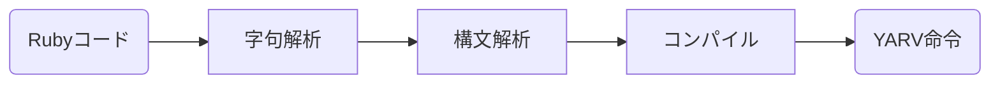
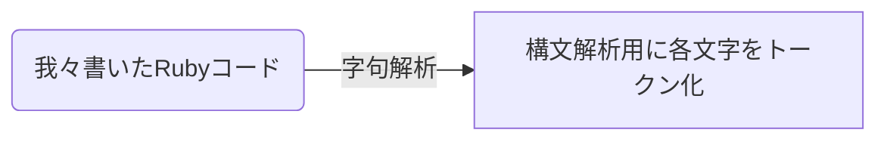

## はじめに

### ⅰ. 動機

本記事は友達のいない私が2023-2024の冬休みの自由研究の成果として書いていく記事です。
エンジニア歴も文系出身でコンピューターサイエンスやプログラミング言語に関する知識も浅いので、運悪く本記事を見てしまった方は温かい舌打ちをしながら見守ってください。

あまり記事とか書いたことはないですが、論文読んだり、文章を書くこと自体は好きなので書いてみようと思いました。

※追記）こんな長くなってしまったのは、多分性格です。いろんなことを調べてたらいっぱい書きたくなるのです。これでもだいぶ減らしたほうです。

### ⅱ. 本記事の概要

本記事はタイトルの通り計算理論についての記事です。特に『Rubyのしくみ』と『計算理論の基礎』を読んで学んだことが中心になっていきます。

そして本記事では、この後も本文で説明いたしますが、①プログラミング言語の限界はなにか、②プログラミング言語に共通する性質はなにか、という2点が一貫したテーマとなります。なので『Rubyのしくみ』と『計算理論の基礎』の2冊の内容を元に論理を再構築し、また計算理論やプログラミングだけでなく関連諸分野、例えば言語学や言語哲学、はたまた社会学や歴史にも話を巻き込みながら、計算理論への導入をできればなと思っております。

また文献や紹介する書籍に関しては『』で囲い、本文の最後に参考文献としてまとめておきます。

### ⅲ. どういうふうに記事を書いていくか

計算理論に関する基礎や導入に関しては既に様々な記事や本で紹介されています。初心者向きであれば川添愛氏の『白と黒のとびら: オートマトンと形式言語をめぐる冒険』ではキャッチーなストーリー形式で紹介されていたり、技術の専門書系であれば、『正規表現技術入門 ――最新エンジン実装と理論的背景』や『コンパイラ―原理・技法・ツール (Information & Computing)』（通称ドラゴン本。ちなみにこちらはまだ読んでない）あたりでも紹介されています。

となるとただの他の本の写しにならないよう気をつけなければならないといけません。本記事では、CSに馴染みないエンジニア目線で、普段のプログラミングから自然な形で理論へと導くこと、CS以外の周辺諸分野に関わることを意識して書いていきたいと思います。

### ⅳ. この記事のシリーズについて

この記事は3部作想定です。2,3部作は冬休みに書ければなあ...と思っております。

- 1部作目(本記事): "計算理論への入門 with Rubyのしくみ part1 字句解析編"
- 2部作目: "計算理論への入門 with Rubyのしくみ part2 構文解析編"
- 3部作目: "計算理論への入門 with Rubyのしくみ part3 チューリングマシン編"

ではさっそく本編です！

## 目次

1. 言語とはなにか？ 〜テーマを決める〜
2. Rubyのしくみの字句解析を部分を読む
3. 字句解析と正規表現について考える
4. 正規表現から有限オートマトンを導く
5. 有限オートマトンの例を考えてみる
6. 有限オートマトンと正規表現の性質について
7. まとめ/次回以降について
8. 参考文献

## 1. 言語とはなにか？ 〜テーマを決める〜

### ⅰ. テーマを考える

本題に入る前に、考えておきたいことがあります。それは本記事を通して一貫するテーマです。優れた論文や書籍には優れた仮説や疑問があると個人的には思っております。もちろん私は素人なのでいい問いを浮かべられるかはわかりませんが、少しテーマについて深堀って考えてみましょう。

この記事は『Rubyのしくみ』と『計算理論の基礎』という本で学んだことを中心に組み立てていくのですが、前者に関してはその名の通り「Rubyというプログラミング言語がどうやって処理されていくか」という本で、後者に関しては副題が「1.オートマトンと言語」ですから、共通項を取るのであれば 【言語】 、特に 【プログラミング言語】 というものがテーマの中心になりそうです。

【プログラミング言語】についてさらに深ぼってみましょう。【プログラミング言語】も名前の通り、【言語】の一種と考えられそうです。とすると【言語】 について考えることが 【プログラミング言語】 を考えるヒントになりそうです。では【言語】とはなんでしょうか。これは実は難しい問いで、【言語】 という我々に取って一番身近なものは、考えれば考えるほどわからないものなのです。

「そんなことない！辞書を引いて出てきた言葉が言語だ！」とかも言いたくなるかもしれません。では少し考えてみましょう。最近話題のLLM、サービスでいうならChatGPTが生成する 【言語】 の意味と我々が実際に話している【言語】の意味は完全に一致しているでしょうか。仮に一致しているとしてどうやって証明できて、そして一致しているとはどのような状態でしょうか。またChatGPTが【言語】を学習する方法と我々人間が【言語】を習得する方法は同じでしょうか。そうでないとしたら人間が【言語】を習得する過程はどのようなものであるのでしょうか。。。。

このように考えていけば考えていくほど沼にハマっていきます。歴史上の天才といえる偉人たちも【言語】について考え悩まされてきました。ここでその歴史上の天才といえる偉人が考えた【言語】に関する考え方を覗いてみましょう。そうすることで【言語】に関しての疑問や問題点が明確になり、それが【プログラミング言語】への問いとして変換され、本記事のテーマが見えてきそうです。

ここでは特に言語哲学と言語学という２つの学問をピックアップします。

### ⅱ. 言語哲学/言語学とはなにか

#### 言語哲学

誰かに怒られることを厭わずに、哲学とは何かをかなりざっくり言えば、人間とはなにか、人間の認識や思考の本質とは何かに関するような学問です。そして言語哲学とはそういった哲学の問題を考えるために【言語】を中心に据えたものです（言語論的転回ともいいます）。言語哲学といえば、フレーゲやラッセルといった人物も挙げられますがが、なによりも有名なのはL・ウィトゲンシュタインでしょう。そのウィトゲンシュタインの代表的著作が『論理哲学論考』です。

では『論理哲学論考』はどういった著書かといいますと、解釈によっては様々な意見はあるかと思いますが、『思考の限界について、言語の限界を通して思考する』という内容です。もう少し詳しく説明しましょう。岩波文庫で『論理哲学論考』の序文では以下のように書かれています

> 本書が全体としてもつ意義は、おおむね次のように要約されよう。およそ語られうることは明晰に語られうる。そして、論じえないことについては、ひとは沈黙せねばならない。

ちょっとわかりずらいですね。もうちょっと見てみましょう。

> かくして、本書は思考に対して限界を引く。いやむしろ、思考に対してではなく、思考されたことの表現に対していうべきだろう。というのも、思考に限界を引くにはわれわれはその限界の両側を思考できねばならない（それゆえ思考不可能なことを思考できるのでなければならない）からである。
したがって限界は言語においてのみ引かれうる。そして限界の向こう側は、ただナンセンスなのである。

つまり、ウィトゲンシュタインは思考の限界について明らかにしたかったといえそうです。ただ限界ということは境界線を引くことであり、境界線を理解するには境界線によって分けられた２つの側を理解しなければならないが、思考の限界のもう一つの側は思考できない世界であり、思考のできない世界について想像してみても結局それは思考することになり、我々人間にはたどり着くことはできません。しかし、思考は言語によって表現され、言語を思考を写すものとするならば、言語の限界を考えることで思考の限界を考えることはできるのではないかということです。

ここではこれ以上詳しくは説明しませんが、本記事の3部作目である「チューリングマシン」に関する記事でもう少し詳しく論考についての考えを紹介できればと思います。ちなみに『論理哲学論考』の入門に関しては野矢茂樹氏の『ウィトゲンシュタイン『論理哲学論考』を読む』あたりがおすすめです。

とにもかくにも【言語】を考えることで思考の限界に近づけるという態度が言語哲学にはありそうです。

#### 言語学

先ほど上げた言語哲学も含め、言語に関する問題は古代ギリシアからあらゆる時代、あらゆる学者・哲学者によって考えらました。その中でも現代の言語の研究において最も影響を与えた一人として挙げられるのは、F・ソシュールといって間違いないでしょう。

ではソシュールの言語学はいったいどういうものでしょうか。ソシュールの著書事象は少しややこしいのですが、その講義内容は『一般言語学講義』にまとめられています。ソシュールの革新性といえば、言語学の対象、言語そのものを研究の対象にしたことでしょう。ソシュール以前の言語に関する研究は、特定の具体言語やその比較、言語の歴史的変遷に関わる研究でした。そういった研究をソシュールは通時的と分類する一方で、共時的言語のあり方、すなわち非歴史的な言語の構造的なあり方、各具体言語に共通する言語の性質について研究しました。その研究によって言語の記号的な性質が言語学の対象になっていきました。

ソシュールの後継者とも言われるE・バンヴェニストは『一般言語学の諸問題』にてソシュールを以下のように評しています。

> 今日彼に何物かを負うていない言語学者はありません。彼のなを引かない一般理論はありません。

> ...すなわち次の二問を私達はソシュールの学理の中心にあるものとするのであります。
> 1 言語学が倣って立つべき基本的な所与はどのようなものであるか？いかにすればかような所与に達することができるか
> 2 ことばのもつ諸観念はどのような性質のものであるか？それらはどのような関係によって分節されるのであるか？

そしてソシュールによって言語の普遍的なそれ自体の性質がソシュール以後の言語学も注目されるようになりました。

有名な例でいえばR・ヤーコブソンの『音韻論』があげられます。『音韻論』とは音素という意味のある音、すなわち言語機能を果たすための音に注目した研究についてことです。ヤーコブソンの入門としては『音と意味についての六章』が一番わかりやすいでしょう。序文をレヴィ・ストロースが書いている点でも素晴らしい本で、ソシュールやヤーコブソンの言語学的なアプローチが構造人類学、いわゆる構造主義的な現代思想に影響を与えていることも読み取れるでしょう。

また別の例としてN・チョムスキーの『生成文法理論』があげられます。ソシュールとチョムスキーの論の関係はヤーコブソンほど明確ではありませんが、少なからず影響はあると思われます。『生成文法理論』も個別言語の構造というより、あらゆる個別言語に普遍の文法の性質を考えるという態度のもので、より自然科学的な手法で人間の言語能力、言語獲得過程を研究するといったものです。チョムスキーの入門は最近発売された『言語と認知』にてその考え方が記されているのでおすすめです。

言語学に関してのもっと詳細な深堀りは、本記事の2部作目である「構文解析」の記事でやっていきたいと思います。

ここでは一旦導入だけとして、ソシュールの言語学からは、個別言語によらない【言語】の普遍的性質は何かという関心が読み取れそうです。

#### 言語哲学/言語学から抽出される問い

上記で紹介した学問の問いを【プログラミング言語】に単純にあてはめて簡単に導出するなら、言語哲学からは『**①プログラミング言語の限界はなにか**』、言語学からは『**②プログラミング言語に共通する性質はなにか**』という2点が抽出されるのではないでしょうか。

なのでこの2点をもって本記事のテーマとしたいと思います。もちろんこの話題はすでに多くの研究者によって研究されていますし、内容も高度で私に完全に手に追えるものとも思いません。ただその入門中の入門であれば少しは考えることができるのではないかと思います。

### ⅲ. 計算理論について

学問の分野において『①プログラミング言語の限界はなにか』、『②プログラミング言語に共通する性質はなにか』という疑問に向き合ってきたのがまさしく計算理論になります。計算理論に関してここで少しみておきましょう。

#### 学問としての計算理論

『計算理論の基礎』では以下のような説明がされています。

「初版へのまえがき」より

> この科目では、計算機のハードウェア、ソフトウェア、およびそれらの応用に関する基本な数学的性質について学びます。具体的には、何を計算できて何を計算できないか？また、どれくらい速く、どれくらいのメモリ使用量で計算できるか？さらには、そうした計算が、どのタイプの計算モデルで可能となるのか？などについて学びます。

「0: 序論」より

> 本書は、計算の理論の重要な柱を為す3つの分野: オートマトン、起算可能性、複雑さについての教科書である、これら３つの分野はすべて 計算機の本質的な能力とその限界は何か？という疑問に関係している

このように計算理論に関する話題も多岐に渡ります。我々の関心は暫くの間、字句解析や構文解析などの【プログラミング言語】の処理に関する数学的もしくは記号的な説明に関してになりそうなので、3つの分野の中のオートマトンの理論について探っていきます。

### ⅳ. 記事の進め方とゴール設定

この記事は普段プログラミングを仕事でしているが、あまりコンピュータサイエンスの理論に馴染みがない人目線で、普段のプログラミングから計算理論のオートマトン理論へできるだけ直感的に辿りつけるような形で進めていきます。

具体的には、『Rubyのしくみ』での字句解析の部分を読み進め、それをまずはRubyを使ってRubyを字句解析するとどんなコードになるか確かめます。次にそのコードを正規表現を使って書き換えてみます。正規表現を使うとだいぶシンプルにコードが書けるようになるので、そこで正規表現の構造に注目し中身を分解します。そして最後に字句解析の裏側にある性質を数学的記号を使って表します。その数学的記号こそが『プログラミング言語』の性質と限界を知る手段だという風に結論づけていきます。

ゆえにこの記事のゴールは『プログラミング言語』に関する性質を**数学的記号**で表現することです。

これで準備は整いました！本題にいきましょう！！！！

## 2. Rubyのしくみの字句解析を部分を読む

では早速本題にはいりましょう！

### ⅰ. Rubyのコードが実行されるまで

『rubyのしくみ』の最初をみてみますと、こんなことが書いてあります。

> プログラムを実行する手前で、Rubyは何回コードを読み、変換しているだろう？１回？それとも２回？
正解は3回だ。

そしてその後にこのような図があります。



これがrubyという言語が認識されて実行される道のりです。

### ⅱ. どうして変換が３つに分かれているか

『Rubyのしくみ』では上記の図のあとはそれぞれの説明に入っていきますが、少しここで立ち止まって考えましょう。

どうして言語の処理は３ステップに分かれているでしょうか？それは単純に考えればそれぞれ字句解析・構文解析・コンパイラで役割が違うからです。それは間違いなさそうです。では穿った見方をするとどうでしょう？裏にある構造/性質が異なるため３つに分けざるを得なかったと考えることもできそうです。

また、（もちろん言語によって差異はあるかと思いますが）Rubyだけでなく他の言語でも字句解析・構文解析・コンパイラの処理はある程度共通してそうです。ここに何か必然的合理性がありそうです。

となると方針としては字句解析・構文解析・コンパイラそれぞれを１つ１つ見ていき、それぞれの裏に潜んでいる性質を深掘っていくのが良さそうです。今回の記事ではまず字句解析のみを考えていきます。

## 3. 字句解析と正規表現について考える

### i. 字句解析はなぜ必要か

『Rubyのしくみ』では第1章のはじめに字句解析について解説しています。そもそも字句解析とはなんのために行われるか。

> 字句解析では、ソースコード内のテキストを読み込み、それらをRuby言語内で使われる単語の列、トークン列へと変換する。
> ...すなわち、ひとまとまりに読んで理解が可能な単語の列、トークン列へと文字を変換する

すなわち図式化するならば



という図式になりそうです。となるとこの字句解析は何か一定の規則をもってトークン化してそうです。

### ii. 字句解析はどんな処理をしているかrubyで考える

ここで一旦rubyの字句解析の処理を、普段我々が使っているrubyのコードで書いてみましょう。すなわちrubyでrubyを解析するコードです。

#### パターン① 一般的なrubyだけで考えてみる

ここでは『rubyのしくみ』と同じで、`10.times do |n|` という文字をトークン化する処理を考えましょう

普通にrubyだけで構築するならこんな感じの実装が考えられます。

```rb
# 文字をtokenに変えるための参照先
str_hash = {
  "10" => "tInteger",
  "times" => "tIDENTIFIERtimes",
  "." => ".",
  "do" => "keyword_do",
  "|" => "|",
  "n" => "tIDENTIFIERn"
}

tokens = []
tmp_ary = []

str = "10.times do |n|"

str.each_char do |s|
  if s == "." || s == "|"
    tokens << str_hash[tmp_ary.join] unless tmp_ary.empty?
    tokens << str_hash[s]
    tmp_ary = []
  elsif s == " "
    tokens << str_hash[tmp_ary.join]
    tmp_ary = []
  else
    tmp_ary << s
  end
end

tokens << tmp_ary.join unless tmp_ary.join.empty?

puts "トークンの中身は#{tokens}です"
# トークンの中身は["tInteger", ".", "tIDENTIFIERtimes", "keyword_do", "|", "tIDENTIFIERn", "|"]です
```

`str_hash`はruby内部にあるとして所与のものとして、その他のロジックをみてくださいませ。一旦はこのコードでも各コードをトークン化できそうです。しかしこのコードだと処理が複雑な上に、これ以上変数や記号が増えたら対応するのが難しそうです。`10.times do |n|`という文字を処理する専用ならいいですが、拡張性には欠けてしまいますね。

では次に違うパターンを考えてみましょう。少しでもエンジニア経験ある方ならこんなことせずに、正規表現を使うことを思いつくでしょう。次に正規表現について考えましょう。

#### ②正規表現で実装してみる

次は正規表現を使って①のコードをリファクタリングしてみましょう。

```rb
str_hash = {
  "10" => "tInteger",
  "times" => "tIDENTIFIERtimes",
  "." => ".",
  "do" => "keyword_do",
  "|" => "|",
  "n" => "tIDENTIFIERn"
}

str = "10.times do |n|"

tokens = str.scan(/\w+|\.|\|/).map { |token| str_hash[token] || token }

puts "トークンの中身は#{tokens}です"
# トークンの中身は["tInteger", ".", "tIDENTIFIERtimes", "keyword_do", "|", "tIDENTIFIERn", "|"]です
```

どうでしょう！だいぶシンプルになりましたね。`str_hash`を今回自分で書いてるので先ほどと変わらないですが、ロジックの部分に関していえばある程度単語の種類や文字列の拡張にも耐えれそうです。

ここで導き出せる帰結は、字句解析の処理と正規表現の処理が直感的に相性がいいということです。正規表現は文字列マッチングなのですから当然といえば当然です。

我々の目標はいつも使っているプログラミング言語を数学的記号で置き換えることです。
今度は今見た正規表現についてその性質を深堀ってみましょう。字句解析と正規表現は相性がいいのであれば、その裏側にある構造は同じと予想できます。そしてその予想は実際正しいのです。なのである程度親しみのある正規表現を掘り下げることで目標に近づきましょう！

## 5. 正規表現から有限オートマトンを導く

### i. 正規表現を分解してみる

さて先程使った`/\w+|\.|\|/`という正規表現について考えてみましょう。
`\w`を省略せずに書くと`/[a-zA-Z0-9_]+|\.\|/`となるので、こっちの直感的な記法を使って考えてみましょう。

意味としては、この正規表現は「1文字以上の英数字、ピリオド、パイプ文字のいずれか」にマッチするというものです。

ではこの正規表現を分解してみましょう。
そうすると正規表現は「①どんな要素」が、「②どんなパターンまたは規則」に従っているかを表すものと言えそうです。すなわち`[a-zA-Z0-9_]+`という正規表現ならば、①英字と数字の要素が②1文字以上続く規則、という風に考えられそうです。`\.\`という正規表現ならば①「.」という要素、②のみからなる規則と考えられそうです。

ここで少しまとめておきましょう。正規表現は以下の要素に分けられそうです。

***
正規表現は以下の要素に分解できる。

① 文字要素: 「a」「6」「.」「|」などの1つ1つの文字要素。
② 規則要素: 「+」「|（「or」を意味する方）」などの規則を意味する記号。
***

### ⅱ. 集合と関数

正規表現が、①文字要素と②規則要素に分解できることがわかりました。これを数学っぽい言い方にしましょう。

#### 集合

数学ではある要素の集まりのことを**集合**といいます。具体例でいえば `A = {1, 2, 3}`ならば、集合Aは要素1, 2, 3を含むといいます。もしかするとrubyに[Set クラス]()があるのでそちらで説明したほうがわかりやすいかもですね。ruby3.2から組み込みクラスになったのでrequireしなくても使えます。

```ruby
# 集合の作成
set = Set.new([1, 2, 3])
puts set.inspect  # => #<Set: {1, 2, 3}>
```

集合には色々性質があります。順序や重複が無視される（ex: `{1, 2, 1}`と`{2, 1}`は同じ）や集合も集合の要素になれる `{1, {2, 3}}`といった性質があります。必要とあらばその都度説明します。

となると①の文字要素は集合として定義できそうです。`/[a-zA-Z0-9_]+|\.\|/`の文字要素を集合として表すのならば`{a, b, c,..., A, B, C,..., 1, 2..., ., |}`となりそうです。

#### 関数

ある入力に対し、一定の規則を元に出力するものを`関数`といいます。関数もrubyで使っているので説明不要かもしれませんが、あえて改めてちょっと数学っぽく説明すると、`関数`とは対応関係を表す概念といえそうです。簡単に言うと、関数はある集合（定義域と呼ばれる）の各要素を別の集合（値域と呼ばれる）の要素に対応付ける規則です。重要な点は、定義域内の各要素が値域内のただ一つの要素に対応するということです。

例えば入力できる集合Aが`A={1, 2, 3}`のどれか１つ, 関数f(x)は`ランダムにxを1倍か10倍か100倍にする`というものだった場合にAの要素を関数f(x)にいれて返ってくる可能性がある値の集合Bは`{1, 10, 100, 2, 20, 200, 3, 30, 300}`といえそうです。となると関数f(x)は入力するAの集合と出力するBの集合を対応関係づけると言えそうです。一応rubyでも書いてみましょう。

```ruby
# 関数f(x)
def calculate(x)
  y = [1, 10, 100].sample
  x * y
end
# 集合A
set_a = Set.new(1,2,3)
random = set_a.to_a.sample
result = calculate(random)
# 集合B
set_b = Set.new(1, 10, 100, 2, 20, 200, 3, 30, 300)
set_b.include?(result)
# => true
```

#### 正規言語分解の結果

上記のように①文字要素は数学的な言い方をすると集合といえそうです。②の規則は関数っぽいといえそうですが、現状のままだと少し微妙ですね。というのも関数には入力/出力の定義が必要ですがそれが定義されてないからです。仮に入力は文字要素だとして、出力は何になるでしょうか。ここに関しては次で深ぼってみましょう。一旦いままでで見てきたことをまとめます。

***
正規表現は分解すると①文字要素と②規則要素に分解できそうで、さらに①文字要素と②規則要素は数学的に言うと

①文字要素 → 集合
②規則要素 → 関数？？？

ということができそうです。
***

### ⅲ. 計算を状態の変化と捉える

正規表現は**集合**と**関数**に分解できそうということを学びました。ただ関数に関しては入力は明確だが、何を出力かまだ明確ではないのでそこを今度は見ていきましょう。

#### rubyのしくみをもう一度見てみる

『rubyのしくみ』では字句解析の解説でこんな感じの図が使われています。

「1」を読み込む


「0」を読み込む


ここで図中の矢印のところに注目してみましょう。`10.times do |n|`という文字を入力するとき、1文字ずつ検証していきます。この検証するものを検証マシーンとして考えましょう。（検証マシーンとは正規表現の役割をシミュレーションするものだと思ってください）

検証マシーンは`10.times do |n|`からまず1を取得して、特定の規則に合致しているか判断します。そして次に0を読み出して、規則に合致しているか判断します。そして先読みして次の文字が`.`か空白だった場合にそれまで認識していた文字をグルーピング化して1つの語として認識します。これを最後の文字まで繰り返します。

さらにここで`1`だけを読み込んだ状態を考えてください。`[a-zA-Z0-9_]+`という規則がある場合は文字の1文字以上の繰り返しがあります。`1`のあとには`0`だけのこともありますが、`2`や`a`といった文字が100文字以上続く可能性もあり、規則の繰り返しの適用が必要そうです。また`.`や`|`の場合はそれのみで規則が成り立つので、処理の分岐が必要そうです。

#### 順次・分岐・繰り返しによる状態の変化

上記の例から、`10.times do |n|`という文字を認識するには、1文字目から順番に見ていくこと、処理を分岐させること、処理を繰り返すことが必要だといえそうです。これを数学っぽく**順次**, **分岐**, **繰り返し**と定義しましょう。

そして検証マシーンは1文字ずつ文字を読み込み（入力）、次々に読んでいる文字を変え、もしくは読んだ文字による判定をしている（出力）と考えられそうです。もっというならば、現在の読んでいる文字の状態から次の文字への状態の遷移、そしてその状態を判定している考えることができそうです。であるならば②の規則要素は文字要素を入力し、現在の文字状態/状態の判定を出力するような関数といえそうです。

ここまでをまとめてみましょう。

***
正規表現は分解すると①文字要素と②規則要素に分解できそうで、さらに①文字要素と②規則要素は数学的に言うと

①文字要素 → 集合
②規則要素 → 文字要素を入力し、状態を出力する関数

ということができそうです。
***

『チューリングの計算理論入門』という書籍の中でもコンピュータの計算について「ある状態が、外からの刺激によって変化して、状態が変わること」と定義しています（この本にインスパイアされた部分もあります）。上記の本はオートマトン理論の解説はあまりありませんが、計算の本質についてやチューリングマシンの理論について書いてある素晴らしき本でおすすめです。

話は少し脱線しましたが、関数の文字を入力して、状態を出力を返すというのが少しわかりにくいので次は図に書いてイメージしてみましょう。

#### 状態遷移図を描く

`10.times do |n|`を役割する検証マシーンの図を簡単に書いてみます。ただここで話を単純化するために先読み（`.`や空白がある場合にその前までに認識していた文字をグループする処理）は考えないこととします。

なのでここではある程度文字をある程度グループ化させて検証マシーンを動かします。`10.times do |n|`を「`10`,`times`, `do`, `n`, `|`」に分けて文字を入力させていきます。グループ分けせずに入力する方法、すなわち先読み等の導入はあとで行います。

ここではまず`10.times do |n|`のなかで一番文字数の多い`times`の検証をみていきましょう。

まずは最初の状態を定義しましょう。文字を読み込まない状態をスタート状態とします。そして検証マシーン`times`のなかの`t`を読み込みます。`t`を読み込んだときに遷移する状態を状態Aとします。状態Aはいうなれば検証マシーンが`[a-zA-Z0-9_]+`の部分の規則を適用させてときに遷移する状態といえそうです。


`t`の検証でマシーンは状態Aに遷移しました。次に`i`を読み込みます。`i`も`[a-zA-Z0-9_]+`の規則にあてはまるので、状態Aの状態Aに遷移します。図にするとこんな感じです。いわば繰り返しを表現しています。


`m`以降も同じ手順になります。つまり最後の文字まで入力すると状態Aにいることになります。この状態Aは`[a-zA-Z0-9_]+`に動いた通りの結果なので、正規表現的にはマッチする状態といえそうです。

次にもう一回スタート状態に戻りましょう。そして今度は`.`か`|`を読み込むパターンを考えましょう。そうすると図はこのような形になります。


`.`を入力すると状態Bに、`|`を入力すると状態Cにいきます。状態Bも状態Cも規則どおりなのでこれも正規表現的にはマッチする状態といえそうです。

最後に指定された文字外（アルファベットや英数字、「.」「|」）以外の文字のパターンを考えましょう。「■」という文字を集合の範囲外の要素とすると、単独で`■`とか`ti■mes`が認識できない文字と言えそうです。


ちょっと図が複雑になっちゃいましたね。ここでは途中で「■」を読み込んだらボツ状態という状態に遷移するようにしました。そしてボツ状態に一度入ったらその後どんなに正しい要素が入力されてもボツになります。それがボツ状態のループの意味です（`.■`や`■|`みたいな文字は考えてません。）

ここまでで正規表現をシミュレーションする検証マシーンの図を作成しました。検証マシーンでは特定な要素が入力されたとき、一定の規則のものに検証されて、状態が遷移することがわかりました。どうやらこの流れ、すなわち集合と関数による状態の遷移が、正規表現や字句解析に眠っている性質ということができそうです。

#### 今までのまとめ

ここまでの流れを一旦復習しておきましょう。まずは`10.times do |n|`を字句解析するためにどんな方法があるか考えました。第一にrubyのコードで字句解析するコードを書いてみました。その次に正規表現を使ってそのコードをリファクタリングしたところ、だいぶスッキリ書けるようになりました。どうやら正規表現と字句解析の構造は似てそうだという仮説のもと、今度は慣れ親しんだ正規表現について分解してみました。そうすると正規表現は集合と関数からできていることが発覚しました。そして関数は文字入力に対し、状態を出力するものと定義しました。これらの概念をもとに正規表現と同じ役割したところ、いい感じに図を書くことができ、そのシミュレーションマシーンがうまく動くことが確認できました。

すなわち、たどり着いた結論は

***
集合と関数による状態の変化こそがこの字句解析の本質である
***

という結論にたどり着きました。あとはこれをうまく表現できる方法があれば良さそうです。

### ⅳ. 有限オートマトンを定義する

ここまでで導きだせるのは、字句解析や正規表現の構造は集合と関数による状態の変化によって表現しうることです。そしてその表現を計算理論では**有限オートマトン**といいいます。

そしてここに有限オートマトンの正式な定義を定義します。

***

有限オートマトンは5個組($Q$, $\Sigma$, $\sigma$, $q_0$, $F$)であり、

- $Q$: 状態の有限集合
- $\Sigma$: アルファベット（要素）の有限集合
- $\sigma$: 遷移関数 $Q \times \Sigma \rightarrow Q$
- $q_0$: 開始状態。ただし$q_0 \in Q$
- $F$: 受理状態の集合。ただし$F \subseteq Q$

とする。
***

ちょっといきなり数学的な記号ばっかでびっくりしますが、内容はさきほど説明したものと同じです。
`/[a-zA-Z0-9_]+|\.\|/`の正規表現をこれにあてはめてみましょう。

$Q$は状態の集合のことです。先程まで書いてた図のスタート状態、状態A, 状態Bなどのことを指します。$\Sigma$:は文字要素の集合です。例でいうと英数字、ドット文字、パイプ文字のことです。$\sigma$はさっきの図で言うところの矢印にあたります。$\sigma$のところにある$Q \times \Sigma \rightarrow Q$が関数の中身を表していて、左側のQが今現在いる状態で、その状態のときに特定のアルファベット$\sigma$が与えられると、別の状態（右側のQ）に遷移するという意味になります。

$q_0$はスタート状態のことで基本一つです。$q_0 \in Q$は難しく見えますが、$q_0$も$Q$の要素といっているだけです。$F$は規則どおり最後まで状態遷移した場合にたどり着く状態です。こちらは複数の可能性があり、$F \subseteq Q$は$F$は$Q$の部分集合という意味です。

正式な定義も数学の記号がいっぱいでてくるので、最初は少しビビりますが慣れれば大したこともないことがわかるでしょう。

説明は以上です。有限オートマトンの例を見て理解を深めましょう。

## 5. 有限オートマトンの例を考えてみる

いくつか遷移図と定義の具体例をみていきましょう

### 例１: 001が入る文字列を受理するオートマトン

文字列の中に「001」が入る文字を受理する有限オートマトン$M$

$M$の定義を以下とする

- $Q$: $q$,$q_0$, $q_{00}$, $q_{001}$
- $\Sigma$: {0, 1}
- $\sigma$: 図を参照。（図か表で書くのがだいたいわかりやすい）
- $q_0$: $q$。
- $F$: {$q_{001}$}


この文字は0と1だけを受け付けます。「001」が文字に入ればいいので、「0000000001」「011000100」は受け付けますが、「011010101」「0101」などは受け付けません。
オートマトンとしては0が1回来た状態を$q_0$, 2回きた状態を$q_{00}$、 3回来た状態を$q_{001}$として、あとは入力は2パターンしかないので各状態の遷移を2パターンずつ書いてくだけです。

01の入力はコンピュータの世界ではバイナリとして使われていますし、0,1をONとOFFに書き換えれば他にも汎用性はありそうです。オートマトンが字句解析以外のモデルとして考えられることがわかります。

さきほど`10.times do |n|`の遷移図を書いたときはボツ状態を書きましたが、通常は書きません。受理状態にたどり着かなければその文字は受理しません。

### 例2: さっきの『rubyのしくみ』で使ったやつを拡張してみる

rubyにはインスタンス変数(ex: @user)やクラス変数(ex: @@user)がありますよね。この@は先頭ならば許可しますが、文中は許可しません。
よって有限オートマトン的に言えば@は要素だが、関数に制約があるといえそうです。正規表現で表すならば`/(@{0,2}\w+)|\.|\|/`こんな感じです。

この文法を加えて改良した有限オートマトンを定義してみましょう。

- $Q$: {スタート状態, 状態A, 状態B, 状態C}
- $\Sigma$: {a..z, A..Z, 0..9, 「.」, 「|」, 「@」}
- $\sigma$: 図を参照。（図か表で書くのがだいたいわかりやすい）
- $q_0$: スタート状態
- $F$: {状態A}


さっきの遷移図では`.`と`|`が与えられたときの状態を分けていますが、今回の図では一つに統一しています。そして`@`を入力した状態を追加しています。

このように集合と関数を変えるだけでいろんなパターンを認識できる有限オートマトンができあがります。
少し思考実験で有限オートマトンのアルファベットを英数字や記号全てにし、いつも使っているrubyの命名規則を遷移関数として表せれば、rubyの字句解析もなんとなく見えてきそうです（もちろん難しいですが）。

有限オートマトンの説明はこれにて完了ですが、有限オートマトンに関する知識を最後に深堀って起きましょう。

## 6. 有限オートマトンと正規表現の性質について

ここでは有限オートマトンのいくつかの性質をみていきます。厳密な証明とか導入はせず、ささっといきます。

### ⅰ. 正規言語の定義

ここで少し*正規言語*というものを定義しておきます。

とある特定の有限オートマトン、ここでは$M$としましょう、$M$で受理されるされるすべての文字列の集合を**正規言語**といいます。ここで「正規」とはどんな意味だろうと思うかもしれませんが、意味的には扱いやすいくらいのニュアンスで大丈夫です。

### ⅱ. 正規演算について

正規言語Aと正規言語Bがあった時、AとBの和集合演算・連結演算・スター演算もまた正規言語といえます

***

言語Aと言語Bがどちらも正規だったとすると以下の演算の結果も正規言語となる

- 和集合演算: $A$ $\cup$ $B$ = { $x$ | $x \in A$ または $x \in B$}
- 連結演算: $A$ $\times$ $B$ = { $xy$ | $x \in A$ かつ $x \in B$}
- スター演算: $A$*= { $x_1$ $x_2$...$x_i$ | 各々の$x_i$に対し$x \in A$ かつ　$k \geq 0$}

***

集合において{ $x$ | $x \in A$ または　$x \in B$}という書き方は、「集合の要素はxであり、xの条件が|以降になる」という意味になります。

和集合というのは集合同士の足し算みたいなものです。連結演算は集合の掛け算みたいなものです。スター演算は集合の要素でできるすべての文字列のことを指します。

ここでは詳しい説明や証明はここではしませんが、『計算理論の基礎』では丁寧に解説してくれてます。この書籍のとても面白いところです。

### ⅲ. 正規表現の厳密な定義と有限オートマトンとの等価性

実は我々がさきほど導入で扱っていた正規表現にも数学的な定義が存在します。

***

$R$が以下のいずれかならば、$R$は正規表現であるといえる

- ①アルファベット$\Sigma$に属する$a$
- ②&epsilon;
- ③∅
- ④$R_1$と$R_2$を正規表現として($R_1$ $\cup$ $R_2$)
- ⑤$R_1$と$R_2$を正規表現として($R_1$ $\times$ $R_2$)
- ⑥$R_1$を正規表現として($R_1$*)

***

①はそのまま特定の文字列aの要素だけのアルファベットの集合{a}, ②は空文字を表す{&epsilon;}の集合、③は空集合を表します。
④は正規表現の和集合、⑤は正規表現の連結演算、⑥は正規表現のスター演算、これらもまたすべて正規表現となるという意味です。

そして実は正規表現と有限オートマトンの能力は等価という事実があります。すなわち特定の有限オートマトンは、その有限オートマトンが記述する言語（正規言語）を認識する正規言語に変換できるのです。

証明は一般化非決定性有限オートマトンというものを使うと証明できます。詳しくは『計算理論の基礎』を参照ください。

つまりこの記事ではすなわちこの法則に則って正規表現から有限オートマトンを導きました。

またこの正規表現とオートマトンの関係、そして正規表現処理システムの実装などに関しては『正規表現技術入門 ――最新エンジン実装と理論的背景』で詳しく書かれています。この本はrubyの正規表現エンジンである「鬼車」の制作者の方によって書かれているので、ruby書いている人には親近感もあり、なおかつわかりやすい構成で書かれておりとても素晴らしい本です。

### ⅳ. 非決定性有限オートマトン

有限オートマトンという名称からは、オートマトンには有限以外にもいくつか種類があることが想像できます。
そしてそれは正しいのです。構文解析で使われるモデルにはプッシュダウンオートマトンというモデルのオートマトンがあり（実質これは無限オートマトンといってもよさそうです。無限/有限は次回紹介します）、それが使われています。

構文解析に関しては次回以降の記事で書くとして、有限オートマトンの中にもいくつか種類があります。それは非決定性有限オートマトンと決定性有限オートマトンです。この決定性/非決定性の性質はとても重要で、今後の計算理論の展開でもよく使われるようになっていきます。

#### 決定性/非決定性とはなにか

我々が今まで見てきたのは決定性有限オートマトンというもので、ある状態からアルファベット１文字が与えられると特定の一つの状態に遷移するものでした。非決定性有限オートマトンはある状態からアルファベット１つ与えられた場合に、複数の遷移先候補があるもののことをいいます。ある一つの状態からの遷移先が決まっていないということで、この性質を非決定性といいます。

例で見たほうがわかりやすいので例を見てみましょう。

#### 非決定性有限オートマトンの例

以下は$\Sigma$が{1, 2}である非決定性有限オートマトンの例です。ベースは今まで扱った決定性の有限オートマトンと同じです。このオートマトンは最後から3番目の位置に1がある言語を認識します（00100,00000100など）。


注目してほしいポイントはアルファベット1が入力である場合に、$q_1$から伸びる矢印がループと$q_2$に向かうもので2つあることです。決定性の場合は必ず一つのアルファベットが一つの状態に向かいますが、非決定性の場合は2つ以上の状態に行く可能性があります。

「00100」の処理を例に考えると、３つめの１が入力された場合に処理が2つ同時に進行します。

- 1がループされる処理: 次の入力0で再度ループし$q_1$にとどまり、その次の入力でもループし$q_1$にとどまる
- 1が$q_2$に向かう処理: 次の入力0で$q_3$に行き、さらにその次の入力で$q_4$へ行く。$q_4$は受理状態なので受理する。

普段のプログラムからいえば、マルチスレッド/マルチプロセスみたいな感じですかね。複数に分かれた処理のうち、最後の入力時に1つでも受理状態であればこのオートマトンはその言語を受理するといえます。

#### εについて

非決定性有限オートマトンは入力文字として、εを受け付けます。εは空列なのでε入力されると自動的に次の状態へ進む。これも例をみてみたほうがわかりやすいので例をみてみます。

以下は入力で受け付けるのは0のみで、0の数が2か3の倍数になるような言語を認識するオートマトンです（たとえば「0000」「000000」を受け付ける）


スタート状態にεがあるのでこのオートマトンはスタート状態直後に処理が分岐が２つにわかれる。上のグループは0が2の倍数を判定し、下のグループは3の倍数を判断する。なので2の倍数と3の倍数を2つのプロセスで確認しているイメージになります。

#### 非決定性有限オートマトンの定義

ここで非決定性有限オートマトンを定義しましょう。定義は有限オートマトンとほとんど同じです。遷移関数だけすこし違います。

***

有限オートマトンは5個組($Q$, $\Sigma$, $\sigma$, $q_0$, $F$)であり、

- $Q$: 状態の有限集合
- $\Sigma$: アルファベット（要素）の有限集合
- $\sigma$: 遷移関数 $Q \times \Sigma_ε \rightarrow Q$
- $q_0$: 開始状態。ただし$q_0 \in Q$。
- $F$: 受理状態の集合。ただし$F \subseteq Q$。

とする。
***

$\Sigma_ε$はアルファベットとεをあわせた集合という意味です。

#### 非決定性有限オートマトンの性質

実は決定性有限オートマトンと非決定性有限オートマトンは能力において等価です。
つまり非決定性有限オートマトンで表せることは決定性有限オートマトンで表せるということです。

ではなぜ非決定性が重要なのでしょう。１つは非決定性のほうが状態数が少なくて済むからです。さっきの非決定性有限オートマトンの例を有限オートマトンで表そうとすると状態数が倍以上になります。非決定性有限オートマトンはシンプルに書けます。もう一つのポイントはεの性質がとても重要で、今後の証明や新たな概念の導入に役立つからです。ここらへんは次章以降で説明します。

## 7. まとめ/次回以降について

### まとめ

当初立てた我々の目標は２つでした。それに合わせて今回わかったことをまとめてみましょう。

#### プログラミング言語に共通する性質はなにか

#### プログラミング言語の限界はなにか

### 次回予告: 計算理論への入門 with Rubyのしくみ part2 構文解析編

後で書く

### 次回予告: 計算理論への入門 with Rubyのしくみ part3 チューリングマシン編

後で書く

## 8. 参考文献 / 本文で紹介させていたただいた文献

- Pat Shaughnessy 『Rubyのしくみ Ruby Under a Microscope』 訳: 島田 浩二・角谷 信太郎 , 出版: オーム社, 2014.
- Michael Sipser 『計算理論の基礎 原著第3版 1.オートマトンと言語』 監訳: 田中 圭介・藤岡 淳  訳: 阿部 正幸・植田 広樹・太田 和夫・ 渡辺 治, 出版: 共立出版, 2023.
- 川添愛 『白と黒のとびら: オートマトンと形式言語をめぐる冒険』, 出版:  東京大学出版会, 2013.
- Ａ.Ｖ.エイホ, Ｍ.Ｓ.ラム, Ｒ.セシィ,Ｊ.Ｄ.ウルマン『コンパイラ―原理・技法・ツール (Information & Computing)』訳: 原田 賢一, 出版: サイエンス社, 2009.
- Ludwig Josef Johann Wittgenstein 『論理哲学論考』 訳: 野矢茂樹, 出版: 岩波文庫, 2003.
- 野矢茂樹『ウィトゲンシュタイン『論理哲学論考』を読む』出版: ちくま学芸文庫, 2006.
- Ferdinand de Saussure『一般言語学講義』 訳: 小林 英夫 出版: 岩波書店, 1972
- Émile Benveniste 『一般言語学の諸問題』 監訳: 岸本通夫 訳: 河村正夫・木下光一・高塚洋太郎・花輪光・矢島猷三 出版: みすず書房, 2022.
- Roman Osipovich Jakobson 『音と意味についての六章』序: Claude Lévi-Strauss 訳者: 花輪光 出版: みすず書房, 2017.
- Avram Noam Chomsk 『言語と認知: 心的実在としての言語』 訳: 加藤 泰彦・加藤 ナツ子 出版: 秀英書房, 2023
- 新屋良磨，鈴木勇介，高田謙 『正規表現技術入門 ――最新エンジン実装と理論的背景』出版: 技術評論社, 2015
- 高岡 詠子 『チューリングの計算理論入門』, 出版: ブルーバックス, 2014.
